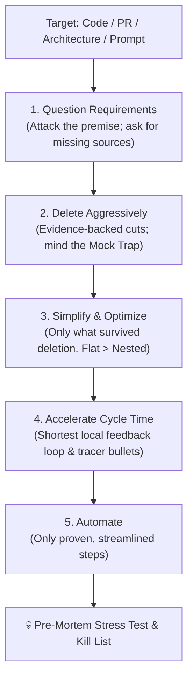

# 🍈 melon — Make Everything Lean, Optimized & Necessary

An adversarial first-principles review protocol for AI coding agents and engineers. Point it at a codebase, an architecture, a pull request, or an LLM prompt; it questions the requirements, deletes what should not exist, and only then simplifies, accelerates, and automates what survives.

> *"Use your melon."* (humor setting: 85%)



The full protocol, including the report format, lives in [`skills/melon/SKILL.md`](skills/melon/SKILL.md).

---

## ⚡ Installation

melon is a single markdown file, so it runs anywhere an agent can read a prompt. There are no runtime dependencies.

### Claude Code

**As a plugin** (invoked as `/melon:melon`):

```
/plugin marketplace add jdiazromeral/melon
/plugin install melon@melon-marketplace
```

**As a personal skill** (invoked as `/melon`):

```bash
git clone https://github.com/jdiazromeral/melon.git
mkdir -p ~/.claude/skills
ln -s "$(pwd)/melon/skills/melon" ~/.claude/skills/melon
```

### Antigravity CLI (`agy`)

```bash
git clone https://github.com/jdiazromeral/melon.git
agy plugin install ./melon
```

`agy plugin install` copies the plugin, so re-run it after pulling updates. Per-project alternative: copy `skills/melon/SKILL.md` to `.agents/skills/melon/SKILL.md`.

### Cursor, Windsurf, and others

Paste the contents of `skills/melon/SKILL.md` into a project rule or your custom instructions.

### Upgrading from v1.1

* **Claude Code:** v1.1 installed melon as a command (`~/.claude/commands/melon.md`). It still works, but if you move to the skill or plugin above, remove it first to avoid a duplicate `/melon`: `rm ~/.claude/commands/melon.md`.
* **Everything else:** file paths and the skill name are unchanged, but v1.2 restarted the repository history, so `git pull` in an old clone fails. Delete the clone and clone again; your existing symlinks keep working if the new clone lands at the same path.

---

## 🚀 Running a Review

* **Claude Code:** `/melon review the authentication flow in src/auth/` (or `/melon:melon …` as a plugin)
* **Antigravity CLI:** `activate_skill melon` or *"Run melon against this PR"*
* **Deep mode:** *"Run melon --deep on our database migration architecture"* spawns an isolated red-team subagent and produces the full report.
* **Any chat agent:** paste `skills/melon/SKILL.md` into the conversation.

Small targets (a PR, a diff, a single prompt) get a short report; architectures, codebases, and `--deep` runs get the full scorecard. Sections with no findings are omitted, and "nothing to delete" is a valid answer.

---

## 🧠 Lineage

* **The five-step algorithm** is Elon Musk's. He walked through it on the 2021 Starbase tour with Everyday Astronaut, and Walter Isaacson's *Elon Musk* (2023) documents it. Its sharpest line is his too: *"Possibly the most common error of a smart engineer is to optimize a thing that should not exist."*
* **melon** adapts it into a review protocol for AI agents by [Javi Díaz](https://github.com/jdiazromeral), adding adversarial verdicts, LLM prompt-auditing heuristics, boundary-seam safety rails, and a pre-mortem stress test.

---

## 📄 License

GNU Affero General Public License v3.0 or later (AGPL-3.0-or-later). See [LICENSE](LICENSE) for details.
